# Защищенные мультисервисные телекоммуникационные системы

## № 1 Модель Харрисона-Руззо-Ульмана

### Задача 1. Построить матрицы и записать в виде команд сценарий атаки с помощью троянской программы в системах, функционирующих на основе модели Харрисона-Руззо-Ульмана (ХРУ)

> Дано: Пусть имеется два субъекта: s1 - доверенный пользователь, admin и s2 - рядовой пользователь, user; и два каталога o1 и o2, владельцами которых являются пользователи s1 и s2. В каталоге o1 имеется объект o3 с секретной информацией. Исходная матрица доступа имеет вид:

|S |o1| o2| o3|
|---|---|---|---|
|s1| own, r, w, e| r, w, e | own, r, w, e|
|s2| | own, r, w, e | |

### Решение:

Атакующий s2 должен создать в своем каталоге o2 файл с трояном и дать права rwe пользователю s1 на этот файл. Далее ожидает запуска доверенным пользователем s1 ( или исп. команду sleep()) трояна из каталога o2. Главная цель убедить пользователя s1 запустить файл. Когда пользователь s1 запускает файл, троян скопирует секрет из o3 в o2, затем делегирует права доступа для атакующего s2, который теперь может работать с тем же уровнем доступа, что и s1. В итоге файл становится доступным для чтения s2, и атакующий может его прочитать из каталога o2. 

```bash
command "создать файл" (s2, троян):
  if "write" принадлежит [s2, o2] then
    Создать объект троян;
    Ввести {"own", "read", "write", "execute"}
    в [s2, троян];
    end if
  if {"read", "write"} подмножество [s1, o2] then
    Ввести {"read", "write", "execute"} в [s1, троян];
    end if
  end command
```

|S |o1 (секрет)| o2(секрета нет)| o3(секрет)| o4 (троян)|
|---|---|---|---|---|
|s1| own, r, w, e | r, w, e | own, r, w, e| r, w, e |
|s2| |  own, r, w, e | | own, r, w, e|

```bash
command "запустить файл" (s1,троян): 
  if {"read","write","execute"} подмножество [s1,троян] then
    Создать субъект s(троян);
    Ввести { "read","write","execute"} в [s(троян),o2]; 
    Ввести { "read","write","execute"} в [s(троян),троян]; 
    end if
  if {"own", "read","write","execute"} подмножество [s1,o1] and {"own", "read","write","execute"} подмножество [s1,o3] then
    Ввести {"read","write","execute"} в [s(троян),о1]; 
    Ввести {"read","write","execute"} в [s(троян),o3]; 
    end if 
  end command
```

|S |o1 (секрет)| o2(секрета нет)| o3(секрет)| o4 (троян)|
|---|---|---|---|---|
|s1| own, r, w, e | r, w, e | own, r, w, e| r, w, e |
|s2| |  own, r, w, e | | own, r, w, e|
|s(троян)| r, w, e | r, w, e | r, w, e| r, w, e |

```bash
command "скопировать файл o3 программой s(троян) в o2" (s(троян),o3,o2): 
  if "read" принадлежит [sтр,o3] and "write" принадлежит [s(троян),o2] then 
    Создать объект o';
    Ввести {"own", "read", "write", "execute"} в [s(троян),o']; 
    Ввести "read" в [s2,o']; 
    Читать (s(троян),o3); 
    Записать (s(троян), о'); 
    end if
    Уничтожить субъект s(троян); 
  end command
```

|S |o1 (секрет)| o2(секрета нет)| o3(секрет)| o4 (троян)| o'= o3(секрет)|
|---|---|---|---|---|---|
|s1| own, r, w, e | r, w, e | own, r, w, e| r, w, e | 
|s2| |  own, r, w, e | | own, r, w, e| r

### Задача 2. Построить сценарий аналогичной атаки. Отобразить последовательности команд перехода и изменений матрицы доступа.

> Дано: Доверенный пользователь s1 в исходном состоянии имеет на каталог o2 только права чтения r. Исходная матрица доступа имеет вид:

|S |o1 (секрет)| o2(секрета нет)| o3(секрет)|
|---|---|---|---|
|s1| own, r, w, e| r | own, r, w, e|
|s2| | own, r, w, e | |

### Решение:

s2, являясь владельцем o2, дает на него недостающие права s1

```bash
command "дать права на каталог от владельца" (s1,s2,o2):
  if "own" принадлежит [s2,o2] then
    Ввести {"write","execute"} в [s1,o2];
    end if
  end command
```

|S |o1 (секрет)| o2(секрета нет)| o3(секрет)|
|---|---|---|---|
|s1| own, r, w, e| r, w, e | own, r, w, e|
|s2| | own, r, w, e | |

\newpage

## № 3 Модель с типизованной матрицей доступа

### Задача 1. Построить в соответствии с командой A граф отношений наследственности.

> Дано: Система настроена в соответствии с типизованной моделью доступа. Пусть имеется три типа сущностей: a, b и c. Начальное состояние системы S0: (s1: A) - субъект s1 типа а. Система переходит в новое состояние S0 aS1 при которой создается объект o1 типа с, инициализируются новые субъекты s2 типа b и s3 типа A. Вновь созданным субъектам предоставляются права доступа r' и r'' на объект o1. Переход осуществляется по следующей команде:
```bash
A(s1: A; s2: b; o1: 𝒄)
  Create object o1 of type c;
  Inter r into [s1, o1];
  Create object s2 of type b;
  Inter r' into [s2, o1];
  Create object s3 of type a;
  Inter r'' into [s3, o1];
end A
```

### Решение:

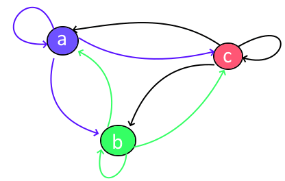

### Задача 2. Реализовать сценарий атаки с помощью троянской программы при условии функционирования по типизованной модели доступа

> Дано: Пусть имеется два субъекта доступа:
> (s1: a) – субъект s1 типа а - доверенный пользователь admin
> (s2: b) - субъект s2 типа b – обычный пользователь user.
> Три объекта доступа:
> - Каталог (o1: v)sec – принадлежит пользователю (s1:a) “own” rs1,o1;
> - Несекретный каталог (o2: )non sec – принадлежит пользователю (s2:b) “own” r′s2,o2;
> - Секретный файл (o3: v)sec в каталоге (o1: v)sec – принадлежит пользователю (s1:a) “own” r′′s1,o3;
> 
> В исходном состоянии граф наследственности имеет четыре вершины: a, b, v, n.
>
> Построить граф отношений наследственности по сценарию атаки троянским конем со стороны пользователя s2 на секретный файл o3 и записать команды перехода из состояния в состояние в нотации модели ТМД.

### Решение:

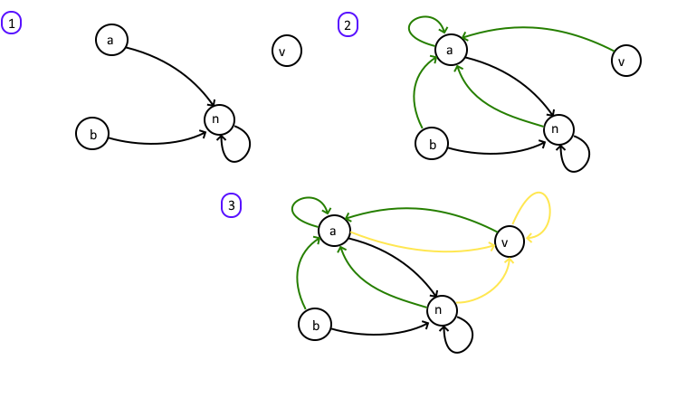

\newpage

## № 4 Модель Take-Grant

### Задача 1. Построить систему команд перехода передачи субъекту x прав доступа A на объект s от субъекта y

> Дано: 
> 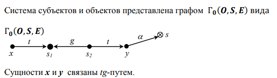

### Решение: 

Объект S2 наследует у объекта Y право доступа к объекту S (у S2 есть на это права — t (take)). Затем объект S2 предоставляет объекту s1 свое право на объект S (у объекта S2 есть права grant для делегирования прав). Далее объект X берет право a на объект S у объекта S1, так как S1 имеет доступ к S, а X имеет право t (take) прав у объекта S1.

Итоговая цепочка атаки: TAKE(S2 Y => S) GRANT(S2 S1 => S) TAKE(X S1 => S).

### Задача 2. Построить систему команд перехода передачи субъекту x прав доступа А на объект s от субъекта y и оценить возможность передачи прав доступа по tg-пути независимо от направления прав t и g 

> Дано: 
> 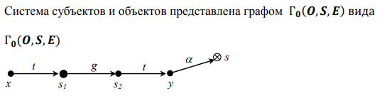

### Решение:

Аналогично задаче 1, объект S2 берет право у Y на доступ к объекту S. Затем S1 создает новый объект ABOBA со следующими правами: TAKE + GRANT, и дает права GRANT для объекта S2, чтобы тот мог работать с объектом ABOBA. Объект S2, имея права на объект S и права GRANT для ABOBA, предоставляет объекту ABOBA права на объект S. S1, будучи владельцем ABOBA, наследует права на S у объекта ABOBA.

Итог: S1 получил доступ к S независимо от направления прав.

### Задача 3. Построить систему команд получения субъектом s прав доступа А на объект w от субъекта u при условии того, что команда grants(A,u,s,w) не может быть задействована

> Дано: 
> 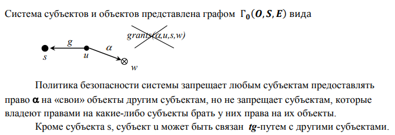

### Решение:

Пусть объект NEW имеет права на объект U, и объект U также имеет права на объект NEW. Тогда:

1. Объект U предоставляет права на S объекту NEW.
2. Объект S берет у объекта NEW право на объект U.
3. Объект S берет у U права на W.

Итог: Объект S имеет права на W.

\newpage

## № 5 Модель ь Белла-Ла Падуллы

### Задача 1. Составить систему уровней допусков пользователей, грифов секретности объектом доступа и матрицу доступа

> Дано: 
> 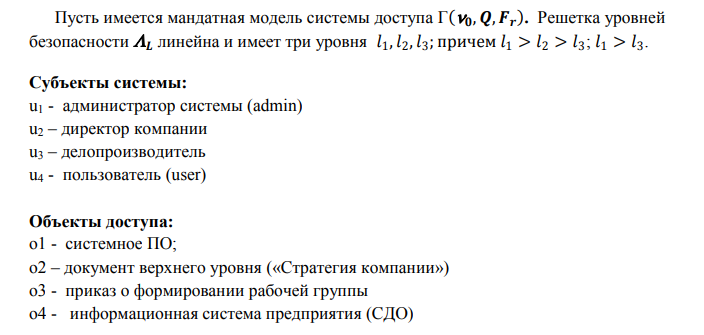

### Решение:

Очевидно, что наиболее конфиденциальная информация содержится в объекте o2

- NRU (Нельзя читать вверх) — Пользователь может читать только свой каталог и более низкие по правам доступа. Все, что выше прав пользователя, недоступно.
- NWD (Нельзя писать вниз) — Пользователь может писать только в свой уровень доступа и выше. Если он попытается записать данные в файлы более низкого уровня доступа, запись будет запрещена.

Основываясь на анализе функций и полномочий пользователей, с учетом правил NRU и NWD устанавливаем уровни допуска субъектов доступа. Поскольку функции и полномочия администратора системы заключаются, прежде всего, в установке и сопровождении ПО, то он должен иметь возможность вносить при необходимости изменения в ПО. Наивысшие полномочия у руководителя предприятия. Делопроизводитель должен иметь возможность готовить конфиденциальные документы (уровней l1 и l2). У непривилегированного пользователя соответственно наименьшие полномочия. Очевидно, что права некоторых пользователей по правилам NRU и NWD (матрица А'[u,o]) являются избыточными. Так, для пользователя u1 (администратор) и для пользователя u4 не являются необходимыми и оправданными права записи в объекты o2, o3 и o4.Для пользователя u3 (делопроизводитель) не нужны права записи в объект o2. Таким образом получаем матрицу доступа, "уточняющую" и корректирующую права доступа, получаемые пользователями по правилам NRU и NWD.

|S|  o1 (l3)| o2 (l1)| o3 (l2)| o4 (l3)
|---|---|---|---|---|
|u1 (l2)| rw| | r| |
|u2 (l1)| r| rw| r| r|
|u3 (l2)| r| | r| rw|
|u4 (l3)| r| | r| |

### Задача 2. Изучить теорему безопасности МакЛина.

> Дано: 
> 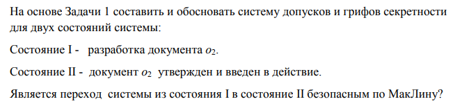

### Решение:

Теорема безопасности МакЛина, также известная как критика базовой теоремы безопасности модели Белла-Лападулы, была представлена Джоном МакЛином в его работе "A Comment on the 'Basic Security Theorem' of Bell and LaPadula". Основная идея этой теоремы заключается в следующем:

1. Базовая теорема безопасности (Basic Security Theorem, BST): Эта теорема утверждает, что если начальное состояние системы является безопасным, и все переходы между состояниями системы также безопасны, то любая последовательность действий сохранит систему в безопасном состоянии. Это положение применяется к модели Белла-Лападулы, которая фокусируется на конфиденциальности данных.
2. Критика МакЛина: МакЛин утверждает, что базовая теорема безопасности (BST) модели Белла-Лападулы не гарантирует реальную безопасность системы. Он доказывает, что можно создать систему, которая формально удовлетворяет BST, но при этом нарушает интуитивные представления о безопасности. В своей работе МакЛин предложил гипотетическую систему, известную как "Система Z", которая выполняет все условия BST, но не является безопасной по сути.
3. Система Z: В этой системе пользователи могут запрашивать понижение уровня конфиденциальности файлов, что позволяет им получать доступ к данным, к которым они в противном случае не имели бы доступа. Таким образом, несмотря на формальное соответствие BST, такая система не может считаться безопасной, поскольку нарушает основные принципы безопасности, заложенные в модели Белла-Лападулы.
4. Выводы: МакЛин показал, что важность BST была переоценена, так как она не охватывает все аспекты безопасности. Теорема демонстрирует, что соблюдение формальных критериев безопасности не обязательно означает реальную безопасность системы. Необходимо учитывать контекст и другие факторы, чтобы обеспечить всестороннюю защиту.

1. Состояние II описано в результатах решения задачи 1
2. Документ готовится по заданию руководителя (пользователь u2) делопроизводителем (пользователь u3). Уже на этапе подготовки он может содержать наиболее конфиденциальные сведения. Матрица доступа в состоянии I: 

|S|  o1 (l3)| o2 (l1)| o3 (l2)| o4 (l3)
|---|---|---|---|---|
|u1 (l2)| rw| | r| |
|u2 (l1)| r| rw| | r|
|u3 (l2)| r| ! -r,w| r| ! r,rw|
|u4 (l3)| r| | r| |

Поскольку при переходе из состояния I в состояние II изменяются одновременно два аспекта безопасности — снижается уровень допуска пользователя u3 и изменяется гриф секретности объекта o4, — то согласно Теореме безопасности МакЛина такой переход считается небезопасным. В частности, в состоянии I пользователь, обладая правами чтения и записи на объекты o2 и o4, может перенести конфиденциальную информацию из объекта o2 в объект o4, который в состоянии II станет доступным для чтения пользователям с уровнем допуска l2, создавая тем самым условия для информационного потока "сверху-вниз".

### Задача 3. Рассчитать количество состояний системы

> Дано: 
> 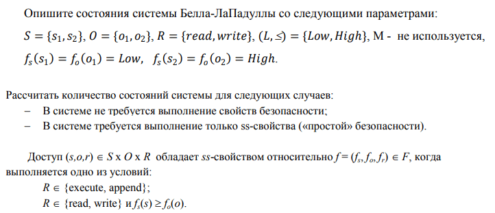

### Решение:

Параметры системы:

- Субъекты: S={s1,s2}S={s1,s2}
- Объекты: O={o1,o2}O={o1,o2}
- Права: R={read,write}R={read,write}
- Уровни безопасности: (L,≤)={Low,High}(L,≤)={Low,High}
- Метки безопасности: fs(s1)=fo(o1)=Lowfs(s1)=fo(o1)=Low, fs(s2)=fo(o2)=Highfs(s2)=fo(o2)=High
- Множество MM не используется

1. В системе не требуется выполнение свойств безопасности

При отсутствии требований к свойствам безопасности любое сочетание субъектов, объектов и прав доступа является допустимым. Рассчитаем общее количество возможных состояний системы.

Для каждого сочетания (s,o,r)(s,o,r):

- Количество субъектов S=2S=2
- Количество объектов O=2O=2
- Количество прав R=2R=2

Таким образом, общее количество состояний будет равно:

Количество состояний=∣S∣×∣O∣×∣R∣=2×2×2=8

2. В системе требуется выполнение только ss-свойства («простой» безопасности)

Для выполнения ss-свойства (simple security property) требуется, чтобы субъект мог читать или писать в объект только если уровень его доступа больше или равен уровню безопасности объекта. Формально:

- R∈{execute,append}R∈{execute,append}
- R∈{read,write}R∈{read,write} и fs(s)≥fo(o)fs(s)≥fo(o)

Возможные комбинации:

- s1s1 с уровнем LowLow может:
  - читать o1o1 с уровнем LowLow
  - писать в o1o1 с уровнем LowLow

- s2s2 с уровнем HighHigh может:
  - читать o1o1 с уровнем LowLow
  - писать в o1o1 с уровнем LowLow
  - читать o2o2 с уровнем HighHigh
  - писать в o2o2 с уровнем HighHigh

Таким образом, учитывая ss-свойство, возможные состояния системы будут:

- s1s1:
  - (s1,o1,read)(s1,o1,read)
  - (s1,o1,write)(s1,o1,write)

- s2s2:
  - (s2,o1,read)(s2,o1,read)
  - (s2,o1,write)(s2,o1,write)
  - (s2,o2,read)(s2,o2,read)
  - (s2,o2,write)(s2,o2,write)

Всего 6 состояний:

Количество состояний= 2(для s1 и o1) + 4(для s2 с o1 и o2) = 6 

\newpage

## № 6 Ролевая модель разграничения доступа и ее типы

### Задача 1. Определить полномочия роли p11.

> Дано: 
> 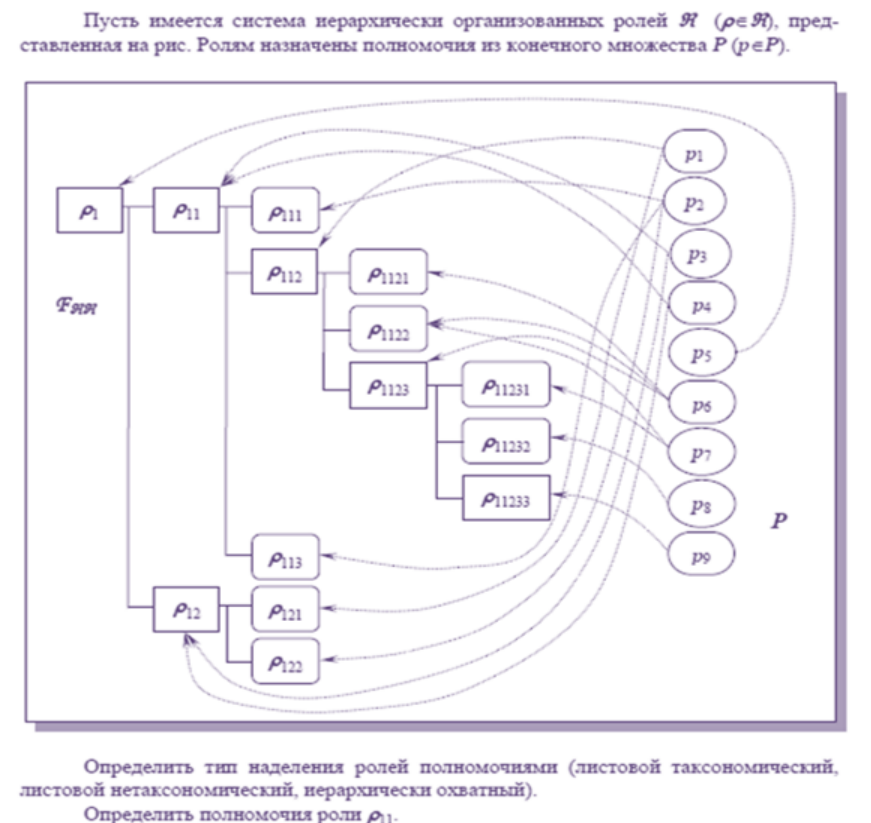

### Решение:

Полномочия назначаются и листовым и узловым ролям, значит у нас иерархически охватный подход.

P(p11) = p3 U p4 U (P(p111) U P(p112) U P(p113 ))=p3 U p4 U (p2U (p1U (P(p1121) U P(p1122) U P(p1123 )))U p2) = p3 U p4 U ( p2U (p1U (p6U (p6U p7)U ( p6U (p7U p8U p9)))U p2 = **p1U p2U p3 U p4 U p6U p7U p8U p9**

### Задача 2.

> Дано: 
> 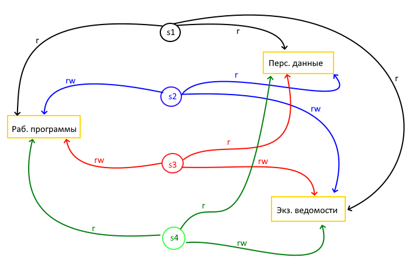

### Решение:

### Задача 3. Составить матрицу смежности объектов доступа H (строка – куда, столбец- кто, диагональные элементы - 0) и матрицу итоговой достижимости Hs

> Дано: 
> 

### Решение:

H =

| O | o1| o2| o3| o4| o5| o6  
|---|---|---|---|---|---|---|
|o1 | 0 |**1**|**1**| 0 | 0 | 0
|o2 | 0 | 0 | 0 | 0 | 0 | 0
|o3 | 0 | 0 | 0 |**1**|**1**| 0
|o4 | 0 | 0 | 0 | 0 | 0 | 0
|o5 | 0 | 0 | 0 | 0 | 0 |**1**
|o6 | 0 | 0 | 0 | 0 | 0 | 0

H^2 =

| O | o1| o2| o3| o4| o5| o6  
|---|---|---|---|---|---|---|
|o1 | 0 | 0 | 0 |**1**|**1**| 0
|o2 | 0 | 0 | 0 | 0 | 0 | 0
|o3 | 0 | 0 | 0 | 0 | 0 |**1**
|o4 | 0 | 0 | 0 | 0 | 0 | 0
|o5 | 0 | 0 | 0 | 0 | 0 | 0
|o6 | 0 | 0 | 0 | 0 | 0 | 0

H^3 =

| O | o1| o2| o3| o4| o5| o6  
|---|---|---|---|---|---|---|
|o1 | 0 | 0 | 0 | 0 | 0 |**1**
|o2 | 0 | 0 | 0 | 0 | 0 | 0
|o3 | 0 | 0 | 0 | 0 | 0 | 0
|o4 | 0 | 0 | 0 | 0 | 0 | 0
|o5 | 0 | 0 | 0 | 0 | 0 | 0
|o6 | 0 | 0 | 0 | 0 | 0 | 0

H^s= H + H^2 + H^3 =

| O | o1| o2| o3| o4| o5| o6  
|---|---|---|---|---|---|---|
|o1 | 0 | **1** | **1** | **1** | **1** |**1**
|o2 | 0 | 0 | 0 | 0 | 0 | 0
|o3 | 0 | 0 | 0 | **1** | **1** | **1**
|o4 | 0 | 0 | 0 | 0 | 0 | 0
|o5 | 0 | 0 | 0 | 0 | 0 | **1**
|o6 | 0 | 0 | 0 | 0 | 0 | 0

### Задача 4. Определить итоговые права доступа

> Дано: 
> Пусть имеется иерархически организованная система объектов доступа и два пользователя u1 и u2
> 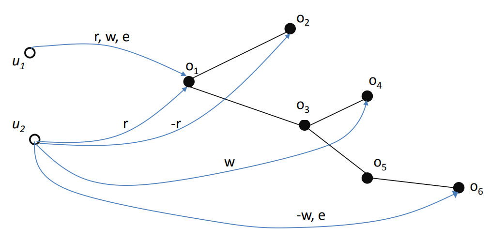

### Решение:

Матрицы прав доступа

Rr =

|  |o1| o2| o3| o4| o5| o6|
|---|---|---|---|---|---|---|
|u1| **1**| 0| 0| 0| 0| 0
|u2| **1**| **-1**| 0| 0| **1**| 0

Rw =

|  |o1| o2| o3| o4| o5| o6|
|---|---|---|---|---|---|---|
|u1| **1**| 0| 0| 0| 0| 0
|u2| 0| 0| 0| 0| 0| **-1**

Re =

|  |o1| o2| o3| o4| o5| o6|
|---|---|---|---|---|---|---|
|u1| **1**| 0| 0| 0| 0| 0
|u2| 0| 0| 0| 0| 0| **1**